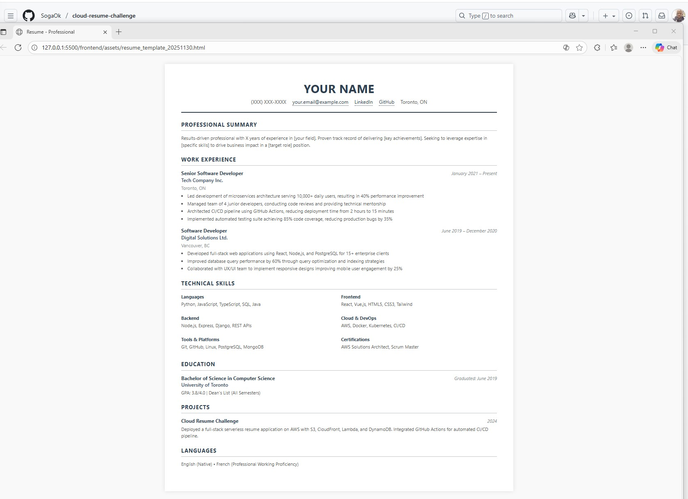
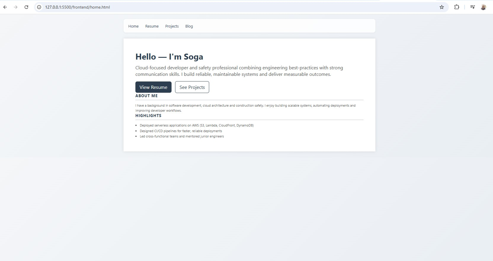

# Frontend Technical Specification

- Create a static website that presents my resume as an html webpage.

## Structure
My static resume website will have the following structure;

- 'index.html': Resume page
- 'blog.html': Blog page 
- 'projects.html': Projects page
- 'style.css' : Shared styling

## Resume Format

I will use a resume format that aligns with the Canadian job market/recruiter expectations.

I will generate my HTML code using Copilot AI and then tweak it as needed. I will attach screenshots/files of my prompts in my assets folder.

## IDE & Tools

To write and test my code I will use VS Code which is free and has a number of useful extensions to make development more efficient, in addition to being a widely used and beginner friendly tool.

I have installed the following extensions for my VS Code setup as suggested by Copilot;
 - Live Server will allow me to preview my site in my browser as I work on it and make changes
 - Prettier assists with code formatting and readability 
 - HTML CSS Support helps with auto completion and validation

## Version Control

As I am working with VS Code on my laptop, I will be pushing changes to my github repo. I have initialized my project folder locally and connected it to my remote github repository.

## AI Prompts

I noticed Github Copilot in my VS Code sidebar and decided to give it a try. So I will be doing my HTML code generation inside my VS Code environment rather than having to switch between VS Code and the Copilot app. This will allow me to work more efficiently.

Prompt to Github Copilot:

```text
I want to generate a static html page to serve my resume. I want my resume format to be tailored to the canadian job market/recuriter specifications.
```

This is the HTML [code generated](./assets/resume_template_20251130.html). I will customize this template to produce my final html resume page.

💡 Side note:

When previewing my site with live server, the html page opened up in my Edge browser. I prefer Chrome so I asked Copilot how to change my live server browser settings in VS Code. My preferred option is;
 1. Go to File → Preferences → Settings.
 2. Search for Live Server Config.
 3. Under Custom Browser, type the browser name (there was a drop down that provided browser options).


This is a liveserver preview of the generated HTML resume. I will be customizing the content with my information;



I will not be making extensive changes to the HTML code as I want to focus on the deployment aspects of the challenge. However I will seperate the CSS components into a seperate file as that is web development best practice. I will do so using the following prompt;

Prompt to Github Copilot:

```text
I want to follow web development best practice by seperating my HTML and CSS components.
```

Github Copilot has successfully extracted the inline CSS into a style.css file and created an  index.html file.

This is the new [HTML file](index.html) and this is the [css file generated](style.css)

I am happy with the HTML resume page as is, I will start to customize it with my information

I will modify my resume site to have a home page and a projects page. I think this will be a more optimal structure and will allow me to show case additional projects that I work on. I will use Copilot AI to generate this modified structure.

Prompt to Github Copilot:

```text
I want to add a home page and a projects page to my site. I would like to have a navigation bar at the top of the page with a clean, professional design that complements what we have so far. I would also like to have a nice background different from the plain white background that the site currently has, again something clean and professional.
```

My website includes a navigation bar and a home page and projects page now. My name has been included in the nav bar and clicking on it navigates to back to the home page from other pages. The Home tab also navigates to the home page as expected. This is redundant so I will remove my name from the nav bar and reposition the page tabs to the left side of the nav bar as they are currently on the right side.

Prompt to Github Copilot:

```text
I would like to move the items in the navigation bar to the left and I would also like to remove my name from the nav bar as it is serving the same function as the home tab.
```

The is the current home page. I would like to have some spacing between the View Resume and See Projects buttons and the About Me section.




